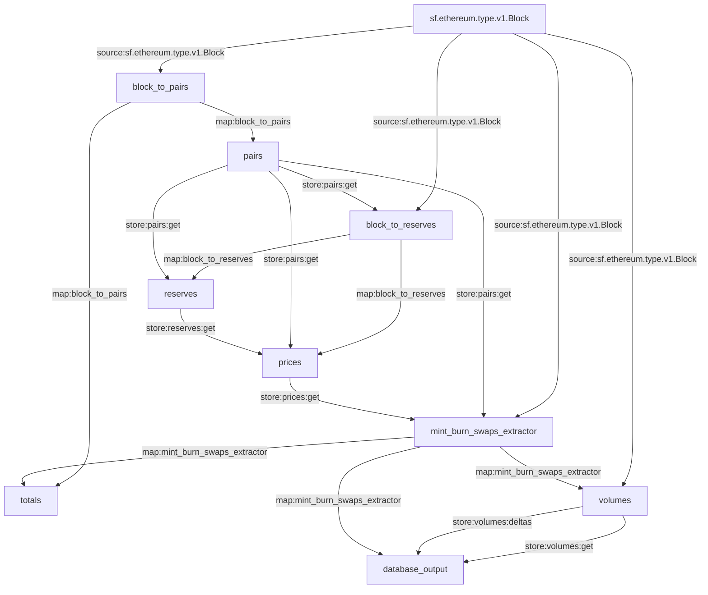
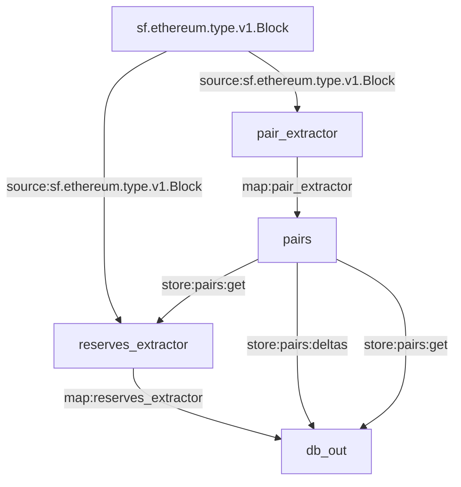

# Substream-based PancakeSwap
[](https://pkg.go.dev/github.com/streamingfast/substream-pancakeswap)
[](https://opensource.org/licenses/Apache-2.0)

This repo holds the `exchange` substream-based "pseudo-subgraph" from PancakeSwap.

## Build and install wasm-pack
```bash
git clone https://github.com/rustwasm/wasm-pack.git $somedir
cd $somedir && cargo build --release
export PATH=$PATH:$somedir/target/release
```

## Build wasm
```bash
go generate ./...
```

## Usage

Copy some blocks locally to speed things up:

```
gsutil -m cp gs://dfuseio-global-blocks-us/eth-bsc-mainnet/v1/0006809* ./localblocks/
gsutil -m cp gs://dfuseio-global-blocks-us/eth-bsc-mainnet/v1/000681* ./localblocks/
gsutil -m cp gs://dfuseio-global-blocks-us/eth-bsc-mainnet/v1/000682* ./localblocks/
gsutil -m cp gs://dfuseio-global-blocks-us/eth-bsc-mainnet/v1/000683* ./localblocks/
```

Compile:

```bash
go install -v ./cmd/sseth
```

Run the native version:

```bash
sseth native_substreams_manifest.yaml pairs 300
sseth native_substreams_manifest.yaml pairs 10000 -s 6811000
sseth native_substreams_manifest.yaml pairs 10000 -s 6821000
sseth native_substreams_manifest.yaml pairs 2000 -s 6831000
```

Run the WASM version:

```bash
sseth wasm_substreams_manifest.yaml pairs 300
sseth wasm_substreams_manifest.yaml pairs 10000 -s 6811000
sseth wasm_substreams_manifest.yaml pairs 10000 -s 6821000
sseth wasm_substreams_manifest.yaml pairs 2000 -s 6831000
```


## Current layout

For `native_substreams_manifest.yaml`:



For `wasm_substreams_manifest.yaml`:



## References

Debezium format example: https://nightlies.apache.org/flink/flink-docs-master/docs/connectors/table/formats/debezium/#how-to-use-debezium-format
Fluvio Smart Modules overview: https://www.fluvio.io/docs/smartmodules/overview/


## Contributing

**Issues and PR in this repo related strictly to Pancake Generated.**

Report any protocol-specific issues in their
[respective repositories](https://github.com/streamingfast/streamingfast#protocols)

**Please first refer to the general
[StreamingFast contribution guide](https://github.com/streamingfast/streamingfast/blob/master/CONTRIBUTING.md)**,
if you wish to contribute to this code base.

## License

[Apache 2.0](LICENSE)
