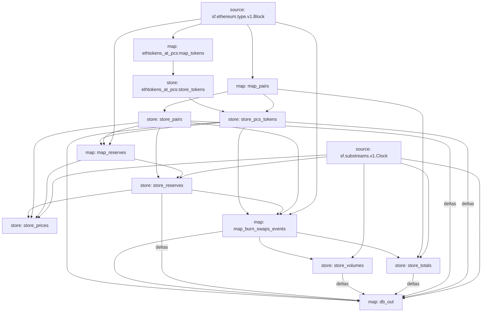

PancakeSwap Substreams
======================

Install [`substreams` and its dependencies here](https://substreams.streamingfast.io/getting-started/installing-the-cli), compile these modules with:

```
# We assume you are at root of project
cd modules/pancakeswap
cargo build --target=wasm32-unknown-unknown --release
```

Run with:

```
substreams run -e bsc.streamingfast.io:443 substreams.yaml store_pairs,map_pairs,db_out,store_volumes,store_totals -s 6810706 -t 6810711
```

> Right now `bsc.streamingfast.io` endpoint is not running Substreams service for a temporary period, the command below will not work, please visit https://substreams.streamingfast.io/getting-started to look for other Substreams to run to test. If you are in dire needs for BNB Substreams support, drop a message in our [StreamingFast Discord](https://discord.gg/jZwqxJAvRs)  

## Visual data flow

This is a flow that is executed for each block.  The graph is produced with `substreams graph ./substreams.yaml`.


