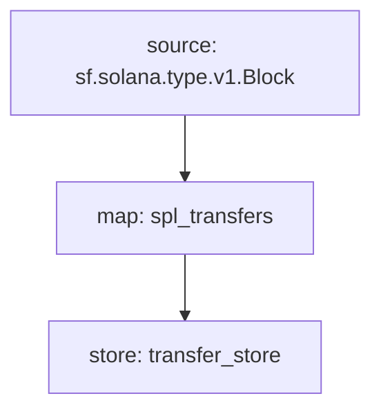

Solana SPL Token Transfers Substreams
=====================================

Install [`substreams` and its dependencies here](../README.md), compile these modules with:

## Building
```
cargo build
```

## Protobuf Generation
```
substreams protogen substreams.yaml --exclude-paths="sf/solana,sf/substreams,google"
```

## Running the Substrams
```
substreams run -k -e mainnet.sol.streamingfast.io:443 substreams.yaml transfer_store -s 130000000 -t 130000100
```

## Visual data flow

This is a flow that is executed for each block.  The graph is produced automatically from the `.yaml` manifest.


