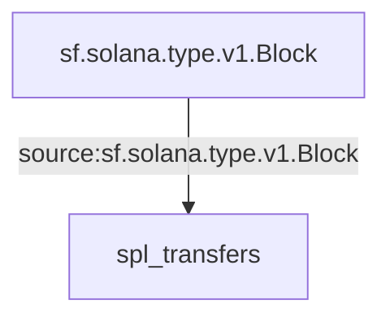

Solana SPL Token Transfers Substreams
PancakeSwap Substreams
======================

Install [`substreams` and its dependencies here](../README.md), compile these modules with:

```
./build.sh
```

and try with:

```
substreams run -k -e localhost:9000 substreams.yaml spl_transfers -s 131450000 -t 131450010
```

## Visual data flow

This is a flow that is executed for each block.  The graph is produced automatically from the `.yaml` manifest.


