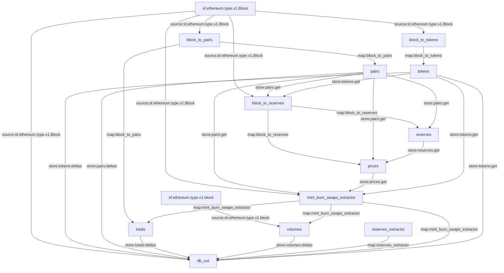

PancakeSwap Substreams
======================

Install [`substreams` and its dependencies here](../README.md), compile these modules with:

```
./build.sh
```

and try with:

```
substreams run -e bsc-dev.streamingfast.io:443 substreams.yaml pairs,block_to_pairs,db_out,volumes,totals -s 6810706 -t 6810711
```

## Visual data flow

This is a flow that is executed for each block.  The graph is produced automatically from the `.yaml` manifest.


